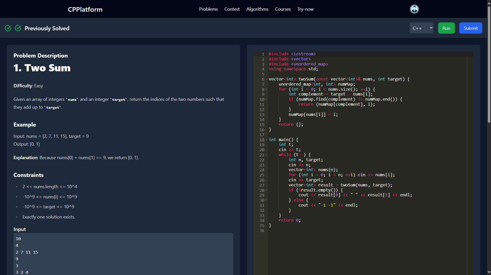
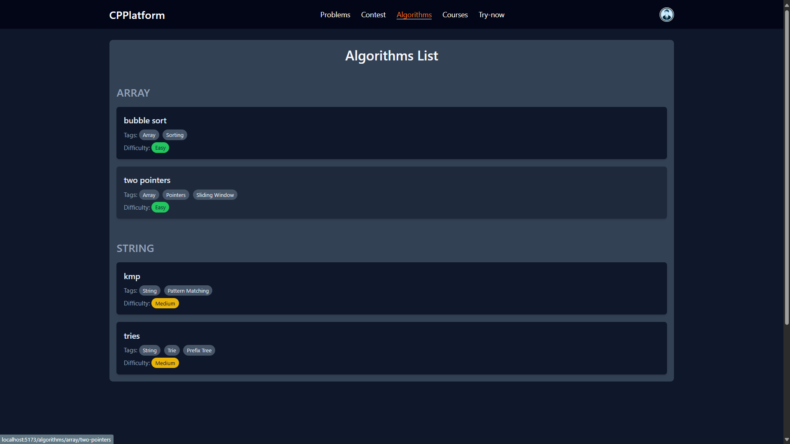
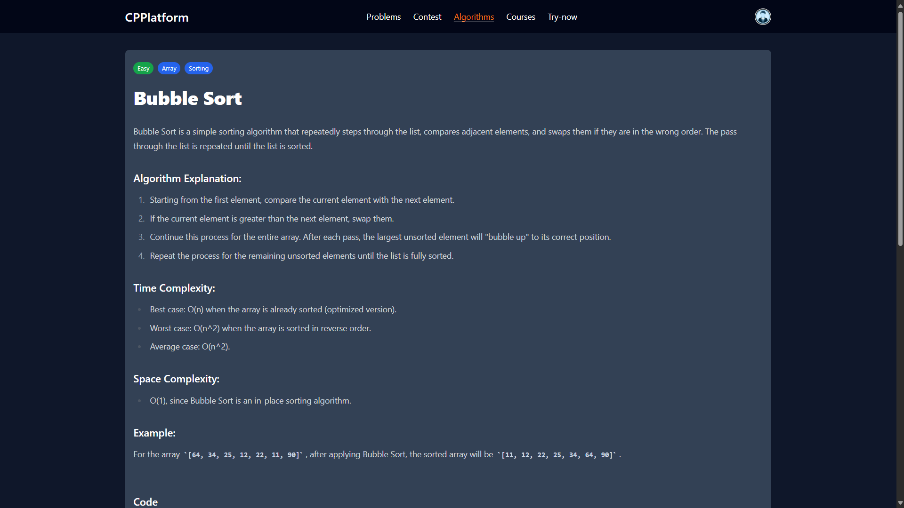
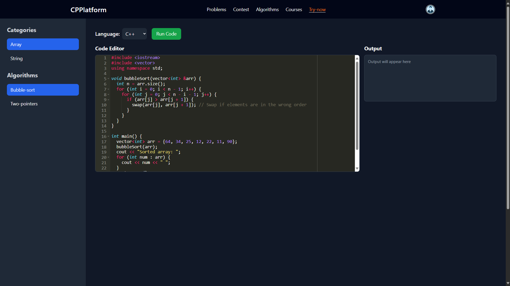
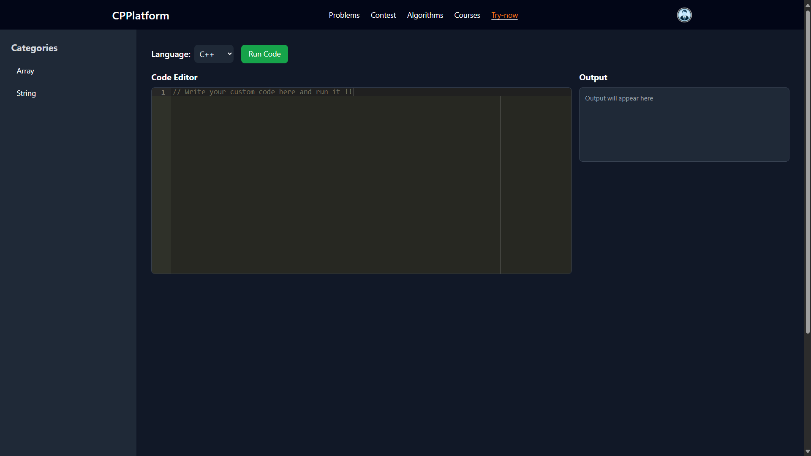
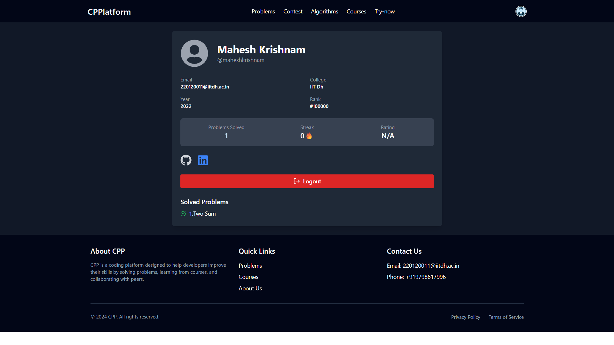

# [LeetCode Clone](https://coding-platform-a7v3.onrender.com)

A full-stack coding practice platform inspired by LeetCode, designed to empower users to sharpen their programming skills. Users can register, solve coding problems fetched from a GitHub repository, execute code in multiple languages, learn algorithms by category, track progress via a profile page, and experiment in a custom playground. Built with the MERN stack and integrated with Judge0 for secure code execution, the platform is hosted on Render for both frontend and backend, ensuring reliable deployment and scalability.

## 🚀 Features

- **User Authentication & Authorization**: Secure user registration and login with JSON Web Tokens (JWT) for access/refresh tokens and bcrypt for password hashing. Supports role-based access (e.g., user for solving, admin for problem management) and guest access via "Continue without login" for instant exploration. Refresh tokens ensure seamless session persistence.
- **Variety of Problems**: A rich library of coding problems across difficulty levels (easy, medium, hard) and topics (e.g., data structures, algorithms, system design), stored in the `problems` folder of a GitHub repository. Fetched dynamically via the GitHub API, enabling collaborative updates and scalability without database overhead.
- **Category-Wise Algorithms to Learn**: Structured learning paths in the `algorithms` folder, covering categories like arrays, linked lists, graphs, and dynamic programming. Each category includes detailed explanations, sample solutions, and curated problem sets to support systematic learning for coding interviews and competitive programming.
- **Problem Solving with Multiple Languages**: Solve problems in various languages (e.g., JavaScript, Python, C++, Java) using a Monaco/Ace editor with syntax highlighting, auto-completion, and real-time feedback. Submissions are evaluated against hidden test cases via Judge0, providing detailed pass/fail results per test case.
- **Track User Progress**: A comprehensive dashboard, accessible via the **Profile** section in the top-right corner, tracks solved problems, submission history, success rates, and performance metrics (e.g., runtime, memory usage). Data is persisted in MongoDB, offering insights like problem-solving streaks, category-wise completion rates, and personalized recommendations.
- **Playground to Run Custom Code**: A dedicated coding environment in the Playground page for writing, testing, and debugging custom code snippets with user-defined inputs. Code is saved in browser local storage for persistence across sessions, distinct from problem submissions, and leverages Judge0 for secure execution.

## 🛠 Tech Stack

- **React for Frontend (`client` Folder)**: Built with React and Vite in the `client` folder for a fast, responsive single-page application (SPA). Features modular components for problem listings, dashboards, profile pages, and a Monaco/Ace editor with code folding, error highlighting, and theme support, ensuring an intuitive coding experience across devices.
- **MongoDB + JWT + bcrypt for Authentication and Progress (`server` Folder)**: MongoDB, managed via Mongoose in the `server` folder, stores user profiles, submission histories, and progress data with efficient indexing for fast queries. JWT handles secure access/refresh tokens, while bcrypt ensures robust password hashing for a secure, scalable user management system.
- **GitHub as a Static Store for Problems and Algorithms (`problems` & `algorithms` Folders)**: Problems and algorithm tutorials are stored in the `problems` and `algorithms` folders of a GitHub repository, fetched via the GitHub API. This version-controlled, static storage offers high availability, collaborative maintenance through pull requests, and eliminates traditional database needs for content.
- **Local Storage for Code Saving (Client-Side)**: Browser local storage persists user code drafts in the editor and playground, enabling auto-save and session recovery without server-side storage, reducing backend load and enhancing usability for iterative coding.
- **Judge0 API for Code Execution (Server-Side Integration)**: Integrates Judge0 for secure, sandboxed code execution, supporting multiple languages with strict time/memory limits (e.g., 2s, 256MB). Hosted Judge0 ensures scalability, reliability, and minimal latency for concurrent submissions with robust error reporting.
- **Render Hosting for Frontend and Backend**: The frontend (`client`) and backend (`server`) are deployed on Render, leveraging managed hosting for automatic scaling, zero-downtime deploys, and simplified CI/CD. Render ensures high availability and secure configuration via environment variables.

## 📂 System Architecture

The platform follows a modular client-server architecture optimized for scalability, security, and maintainability. Below is a textual diagram of the key components and data flows:

```
[Client (Frontend - React in `client` folder)]
    │ Local Storage (Code Drafts)
    │ HTTPS
    ▼
[Render Hosting (Client - Static Site)]
    │
    ▼
[API Calls]
    │
    ├─→ Authentication (JWT + bcrypt)
    │
    ├─→ Progress Tracking (MongoDB)
    │       └─→ [MongoDB Atlas] (Users, Submissions, Progress)
    │
    ├─→ Problem/Algorithm Fetching (GitHub API)
    │       └─→ [GitHub Repo] (`problems`, `algorithms`, `contests` folders)
    │
    └─→ Code Submission/Execution
            │
            └─→ [Judge0 API] (Sandbox Execution)
                      
[Server (Backend - Express.js in `server` folder)]
    │ MongoDB (Users, Submissions, Progress)
    ▼
[Render Hosting (Server - Web Service)]
```

- **Client (Frontend - `client` folder)**: React SPA hosted on Render as a Static Site, using local storage for code persistence. Handles UI rendering, editor integration, profile page access, and API requests for authentication, problem fetching, and submissions.
- **Server (Backend - `server` folder)**: Express.js on Render as a Web Service, managing API endpoints for user auth, progress tracking, and code execution. Proxies requests to GitHub and Judge0, storing dynamic data in MongoDB.
- **Problems & Algorithms (`problems` & `algorithms` folders)**: Stored in a GitHub repository, fetched via API for versioned, scalable content storage. Supports collaborative updates and eliminates database bloat.
- **Contests (`contests` folder)**: Stores contest metadata and submissions (if implemented), integrating with the submission flow for timed challenges.
- **MongoDB Atlas**: Managed database for user profiles, submissions, and progress, with indexes for efficient queries (e.g., userId, problemId).
- **Judge0 API**: External service for secure code execution, handling multiple languages in isolated sandboxes with strict resource limits.
- **Render Hosting**: Hosts both frontend and backend, providing auto-scaling, HTTPS, and environment variable management.

```plantuml
@startuml
title LeetCode Clone Architecture

actor User

' Frontend Layer
component "Client: React\n(`client` folder)" as Client
database "Local Storage" as LocalStorage
component "Render: Static Site\n(Frontend Hosting)" as RenderFrontend

' Backend Layer
component "Server: Express.js\n(`server` folder)" as Server
database "MongoDB Atlas\n(Users, Submissions, Progress)" as MongoDB
cloud "GitHub Repo\n(`problems`, `algorithms`, `contests`)" as GitHub
cloud "Judge0 API\n(Sandbox Execution)" as Judge0
component "Render: Web Service\n(Backend Hosting)" as RenderBackend

' Interactions with Labels
User --> Client : HTTPS
Client --> LocalStorage : Save/Retrieve Code Drafts
Client --> RenderFrontend : Hosted Frontend
RenderFrontend --> Server : API Calls (Auth, Problems, Submissions)
Server --> MongoDB : Store/Retrieve Data
Server --> GitHub : Fetch Problems & Algorithms
Server --> Judge0 : Send Code for Execution
Judge0 --> Server : Return Execution Results
Server --> RenderBackend : Hosted Backend
GitHub --> Server : Provide Problem Data
MongoDB --> Server : Serve User Data

@enduml
```

### Submission Flow
Users write code (saved in local storage), submit via `POST /api/submissions`, and the server processes it through Judge0, storing results in MongoDB and updating the client in real-time via WebSocket (Socket.io).

## ⚙️ Installation

### Prerequisites
- Node.js (v16+)
- MongoDB Atlas (or local MongoDB)
- GitHub Personal Access Token (for problem fetching)
- Judge0 API Key (for code execution)
- Cloudinary Account (for optional file uploads, e.g., profile images)
- Render Account (for hosting)

### Steps
1. **Clone the Repository**
   ```bash
   git clone https://github.com/maheshkrishnam/Coding_Platform.git
   cd leetcode-clone
   ```

2. **Install Dependencies**
   ```bash
   # Backend (server folder)
   cd server
   npm install
   # Frontend (client folder)
   cd ../client
   npm install
   ```

3. **Set Up Environment Variables**
   Create `.env` files in `server/` and `client/`:
   ```env
   # server/.env
   PORT=5000
   FRONTEND_URL=https://your-frontend.render.com
   BACKEND_URL=https://your-backend.render.com
   MONGO_USERNAME=your_mongo_username
   MONGO_PASSWORD=your_mongo_password
   MONGO_URI=mongodb+srv://<username>:<password>@cluster0.mongodb.net/leetcode-clone?retryWrites=true&w=majority
   CORS_ORIGIN=https://your-frontend.render.com
   ACCESS_TOKEN_SECRET=your_access_token_secret
   ACCESS_TOKEN_EXPIRY=1d
   REFRESH_TOKEN_SECRET=your_refresh_token_secret
   REFRESH_TOKEN_EXPIRY=10d
   CLOUD_NAME=your_cloud_name
   CLOUDINARY_API_KEY=your_cloudinary_api_key
   CLOUDINARY_SECRET_KEY=your_cloudinary_secret_key
   GITHUB_ACCESS_TOKEN=your_github_token
   JUDGE0_API_KEY=your_judge0_key
   ```

   ```env
   # client/.env
   FRONTEND_URL=https://your-frontend.render.com
   BACKEND_URL=https://your-backend.render.com
   ```

4. **Run Locally**
   ```bash
   # Start backend (in server folder)
   cd server
   npm run dev
   # Start frontend (in client folder, another terminal)
   cd client
   npm run dev
   ```

5. **Deploy to Render**
   - **Backend**: Create a Web Service on Render, link the `server` folder of your GitHub repo, set the above environment variables, and deploy with `npm start`.
   - **Frontend**: Create a Static Site on Render, link the `client` folder, build with `npm run build`, set environment variables, and deploy.

### Troubleshooting
- Ensure `CORS_ORIGIN` matches `FRONTEND_URL` exactly to avoid cross-origin errors.
- Verify GitHub and Judge0 API keys are valid and have sufficient permissions.
- Check the MongoDB Atlas connection string includes the correct database name (e.g., `leetcode-clone`).
- Review Render logs for deployment issues (e.g., missing environment variables).

## 🖥 How to Use

The platform offers a seamless, LeetCode-inspired workflow for coding practice, supporting both registered and guest users. Follow these steps to get started:

### 1. Register or Sign In
- **Sign Up/Login**: Create an account with your email and password or sign in to access personalized features like progress tracking and submission history.
- **Guest Access**: Click **"Continue without login"** to instantly explore problems and use the playground without an account (note: progress tracking requires login).


### 2. Browse Problems
- Visit the **Problems** section to browse coding challenges, filterable by difficulty (easy, medium, hard) or category (e.g., arrays, graphs).
- Click a problem to view its description, constraints, and sample test cases.


### 3. Solve Problems
- Write your solution in the Monaco/Ace editor, supporting multiple languages (e.g., JavaScript, Python, C++, Java) with syntax highlighting and auto-completion.
- Click **Run** to test against sample test cases or custom inputs for instant feedback.
- Click **Submit** to evaluate against all test cases (including hidden ones) via Judge0, with detailed pass/fail results.



### 4. Learn Algorithms
- Explore the **Algorithms** section for categorized learning paths (e.g., arrays, linked lists, dynamic programming).
- Select an algorithm to view explanations, sample code, and related problems.
- Click **Try** to load sample code in the editor and experiment with it.




### 5. Use the Playground
- Go to the **Playground** page to write and test custom code snippets with user-defined inputs, separate from problem submissions.
- Code is saved in browser local storage for session persistence and iterative coding.
- Run code securely via Judge0 in your chosen language.




### 6. Track Your Progress
- Click the **Profile** section in the top-right corner (available for logged-in users) to access your personalized dashboard.
- View solved problems, submission history, success rates, performance metrics (e.g., runtime, memory), streaks, and category-wise completion rates.

